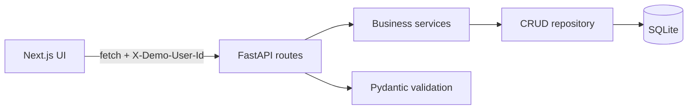
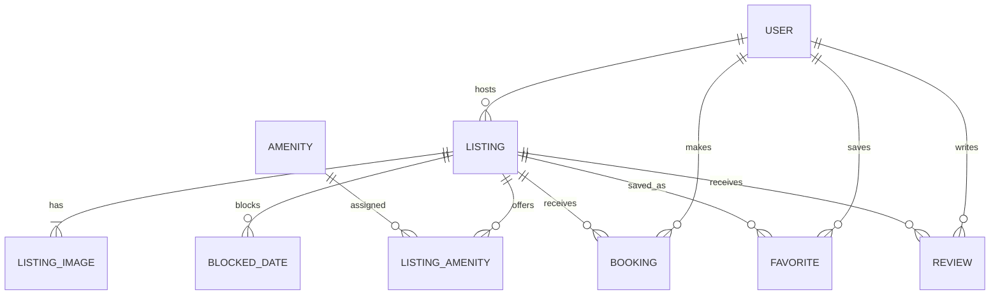

# StayFinder

StayFinder is an original, photo-forward accommodation marketplace inspired by familiar vacation-rental workflows. Guests can discover stays, check real availability, receive server-calculated quotes, complete a mocked checkout, manage trips, and save favorites. Demo hosts can create, edit, archive, reactivate, and safely delete their own listings.

> Live frontend: `https://YOUR-VERCEL-PROJECT.vercel.app`  
> Live API: `https://YOUR-RENDER-SERVICE.onrender.com`  
> Repository: `https://github.com/YOUR-USERNAME/stayfinder`

## Screenshots

Add final screenshots here after deployment:

- Marketplace at desktop and mobile widths
- Listing availability and price quote
- Booking confirmation and My Trips
- Host dashboard and listing form

## Core features

### Guest experience

- Responsive marketplace grid with loading, error, and empty states
- URL-backed location, dates, guests, price, property type, amenities, rating, sorting, and pagination
- Listing gallery, host information, amenities, read-only reviews, and static map
- Availability calendar backed by confirmed bookings and host-blocked ranges
- Server-authoritative quote with nightly rate, nights, subtotal, cleaning fee, service fee, and total
- Mocked checkout with terms validation and duplicate-submit prevention
- Persisted confirmation, upcoming/past/cancelled My Trips sections, and cancellation
- Persistent favorites with optimistic feedback

### Host experience

- Dashboard metrics, owned listings, and reservation details
- Shared React Hook Form and Zod create/edit listing form
- Image URL validation and previews, amenities, pricing, capacity, and unsaved-change warning
- Preview, archive, reactivate, and delete actions
- Automatic archival instead of destructive deletion when future confirmed bookings exist
- Backend role and ownership enforcement, including cross-host protection

## Technology

- Frontend: Next.js 14 App Router, TypeScript, Tailwind CSS, React Hook Form, Zod, React Day Picker, Sonner
- Backend: Python, FastAPI, SQLAlchemy 2, Pydantic
- Database: SQLite created with `Base.metadata.create_all()`
- Tests: Pytest and Playwright
- Deployment target: Vercel frontend; Render or Railway backend

## Architecture



- Route handlers translate HTTP requests and responses.
- Services own booking validation, pricing, ownership, and listing lifecycle rules.
- `crud.py` owns SQLAlchemy queries and persistence.
- The frontend uses one normalized API client; presentation components do not construct backend URLs.
- Search state lives in URL parameters so refresh, back, and forward navigation preserve it.

## Repository structure

```text
airbnb-clone/
├── backend/
│   ├── app/
│   │   ├── routes/
│   │   ├── services/
│   │   ├── crud.py
│   │   ├── database.py
│   │   ├── models.py
│   │   └── schemas.py
│   ├── tests/
│   ├── seed.py
│   └── requirements.txt
├── frontend/
│   ├── app/
│   ├── components/
│   ├── e2e/
│   ├── lib/
│   └── types/
├── docs/
├── render.yaml
├── .env.example
└── Makefile
```

## Database schema

| Entity | Purpose and important constraints |
|---|---|
| User | Demo identity with `guest`, `host`, or `both` role |
| Listing | Host-owned accommodation, price, capacity, facts, and lifecycle status |
| ListingImage | Ordered URL-based listing photography |
| Amenity / ListingAmenity | Reusable amenities and many-to-many listing assignment |
| Booking | Guest stay plus immutable pricing snapshot |
| BlockedDate | Host-defined unavailable half-open date range |
| Favorite | Composite unique key on user and listing |
| Review | Seeded read-only guest feedback |



Bookings snapshot `nightly_rate`, `number_of_nights`, `subtotal`, `cleaning_fee`, `service_fee`, and `total_amount`, so later listing-price changes cannot alter historical reservations.

## Booking and price rules

Stays use half-open ranges: `[check_in, check_out)`. An overlap exists when:

```text
new_check_in < existing_check_out
AND new_check_out > existing_check_in
```

An existing checkout on July 14 is therefore compatible with a new check-in on July 14. The backend checks this rule for both quotes and final booking creation; the creation check protects against stale quotes.

```text
subtotal = nightly_rate × number_of_nights
service_fee = subtotal × service_fee_percentage
total = subtotal + cleaning_fee + service_fee
```

Money is rounded to two decimals with `Decimal` and `ROUND_HALF_UP`.

## API overview

All resources are under `/api/v1`; interactive documentation is available at `/api/docs`.

- Listings: search/list, detail, availability, reviews, create, update, delete/archive
- Bookings: quote, create, detail, user trips, cancel
- Favorites: list, add, remove
- Hosts: owned listings and reservation summary
- Demo users and amenities: list/read support endpoints
- Health: `GET /api/health`

Protected demo operations require `X-Demo-User-Id`. This is deliberately not real authentication, but the backend still enforces user ownership and host roles.

## Local setup

Prerequisites: Node.js 20+, npm, and Python 3.11+.

```bash
git clone https://github.com/YOUR-USERNAME/stayfinder.git
cd stayfinder

python -m venv .venv
# macOS/Linux: source .venv/bin/activate
# Windows PowerShell: .venv\Scripts\Activate.ps1
pip install -r backend/requirements.txt

cd frontend
npm install
cd ..
```

Create `.env` from `.env.example`, then initialize and seed:

```bash
cd backend
python -c "from app.database import init_db; init_db()"
python seed.py
```

Start the backend and frontend in separate terminals:

```bash
cd backend
uvicorn app.main:app --reload --host 0.0.0.0 --port 8000
```

```bash
cd frontend
npm run dev
```

Open `http://localhost:3000`. API documentation is at `http://localhost:8000/api/docs`.

## Environment variables

| Variable | Example | Purpose |
|---|---|---|
| `NEXT_PUBLIC_API_URL` | `http://localhost:8000` | Public backend origin; `/api/v1` is normalized automatically |
| `ALLOWED_ORIGINS` | `http://localhost:3000` | Comma-separated CORS origins |
| `DATABASE_URL` | `sqlite:///./airbnb.db` | Full SQLAlchemy database URL |
| `DATABASE_PATH` | `/data/airbnb.db` | SQLite path used when `DATABASE_URL` is omitted |
| `SEED_IF_EMPTY` | `true` | Seed only when the database contains no users |
| `SEED_ON_START` | `false` | Clear and reseed on every start; ephemeral demo mode only |
| `PORT` | `8000` | Supplied by Render/Railway to the production start command |

`NEXT_PUBLIC_API_URL` and the production frontend origin in `ALLOWED_ORIGINS` are required in deployment. Do not include a trailing `/api/v1`; including it is tolerated, but the origin-only value is clearer.

## Seeding

`backend/seed.py` is deterministic and safe to rerun. It clears application records and creates:

- Five demo users
- Sixteen varied listings and ordered images
- Sixteen amenities
- Confirmed and cancelled bookings
- Blocked date ranges, favorites, and reviews

Do not run `SEED_ON_START=true` against a production database whose changes must be retained.

## Tests and quality checks

```bash
cd backend
pytest -q

cd ../frontend
npm run typecheck
npm run lint
npm run build
npx playwright install chromium
npm run test:e2e
```

Playwright uses an isolated `backend/e2e.db`, reseeds it for each suite run, starts both services, and covers guest and host workflows at desktop, tablet, and mobile widths.

## Demo users

| ID | Name | Role | Suggested demo |
|---:|---|---|---|
| 1 | Alice Chen | Guest | Search, booking, trips, favorites |
| 2 | Marco Rivera | Host | Dashboard and listing management |
| 3 | Sophie Laurent | Host | Cross-host ownership demonstration |
| 4 | James Okafor | Both | Guest and host navigation |
| 5 | Priya Nair | Guest | Alternate user-specific data |

## Deployment

### Backend on Render with persistent SQLite

1. Push the repository to GitHub and create a Render Blueprint from `render.yaml`.
2. Attach the declared persistent disk at `/data`.
3. Set `ALLOWED_ORIGINS` to the deployed Vercel origin.
4. Keep `DATABASE_PATH=/data/airbnb.db`, `SEED_IF_EMPTY=true`, and `SEED_ON_START=false`.
5. Verify `/api/health` and `/api/docs` after deployment.

The disk preserves demo bookings and host edits across restarts. Railway can use `backend/Procfile` with a volume mounted at `/data` and the same variables.

### Ephemeral demo alternative

If persistent storage is unavailable, omit the disk, use `DATABASE_PATH=./airbnb.db`, and set `SEED_ON_START=true`. Data will reset whenever the backend restarts or redeploys. This is a deliberate demo limitation, not durable persistence.

### Frontend on Vercel

1. Import the repository and set the root directory to `frontend`.
2. Set `NEXT_PUBLIC_API_URL` to the deployed backend origin.
3. Deploy with the standard Next.js build command.
4. Add the final Vercel origin to backend `ALLOWED_ORIGINS`, then redeploy the backend.

## Mocked and simplified features

- Demo-user switching instead of passwords or sessions
- Mock card fields; no payment processor or card storage
- URL-based images instead of uploads
- Static SVG map instead of live map pricing pins
- Seeded, read-only reviews
- No guest-host messaging or identity verification

## Known limitations

- SQLite is appropriate for this single-instance assignment demo, not horizontally scaled concurrent production traffic.
- Booking conflict checks are repeated at creation, but a production system should use PostgreSQL transactions and database-level exclusion or locking guarantees.
- Currency is displayed as USD and is not localized.
- Seed image availability depends on external image hosts.
- Host revenue is a simple confirmed-booking total, not accounting software.

## Future improvements

- Real authentication and role claims
- PostgreSQL with migrations and stronger concurrency controls
- Payment intents and webhook-confirmed bookings
- Cloud image uploads and processing
- Interactive map, messaging, and post-stay review submission
- Accessibility audit with assistive technology and broader automated coverage

See [`docs/interview-notes.md`](docs/interview-notes.md) for implementation decisions and extension paths.
